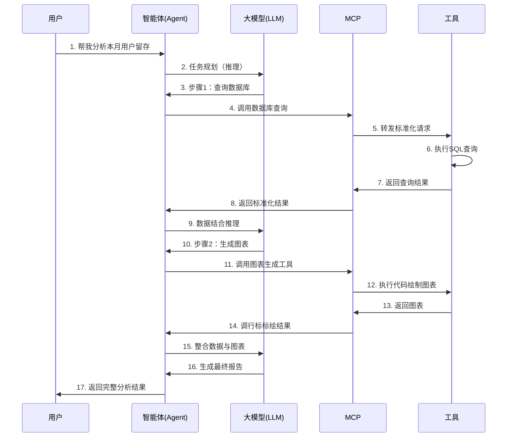

AI Agent是一种能够自主运行、感知环境并具备学习能力的智能系统，在无需或少量人工干预的情况下执行任务，并通过不断的学习和适应来提高自身的性能和准确性。

* 自主性与目标导向：能够独立做出决策，无需过多人工干预。
* 环境感知与工具使用：能够感知环境变化，并利用各种工具完成任务。
* 适应性学习能力：能够从经验中学习，迭代优化自身性能。

perception

memory

reasoning

planning

action

角色（profile）

learning

Planning:

Self reflection/self cirtic/self refinement

Chain of thought/tree of thought

Subgoal decompositioin

Memory:

Short-term memory: context, prompt

long-term memory: preference, history, 

一张图看懂AI Agent全流程，从用户提问到结果返回的17步拆解

