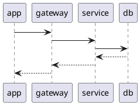
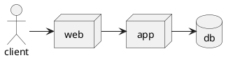

[PlantUML](https://plantuml.com/) is a component that allows to quickly write diagrams using simple and intuitive language.

## 类型

### Sequence

样例：


图片连接：

```markdown

```

sequence-test.md源码：



参与者：participant、artor、boundary、`control`、entity、database、collections

### Deployment

参与者：node

样例：


图片连接：

```markdown

```

deployment-test.md源码：

~~~plantuml

~~~

### MindMap


## integration

### gitlab

https://docs.gitlab.com/ce/administration/integration/plantuml.html