[Mermaid](https://mermaid.js.org/) is a javaScript based diagramming and charting tool that renders Markdown-inspired text definitions to create and modify diagrams dynamically.

### flowchart

### sequence

### ER

### state

### class

### mindmap

```mermaid
mindmap
  root((mindmap))
    Origins
      Long history
      ::icon(fa fa-book)
      Popularisation
        British popular psychology author Tony Buzan
    Research
      On effectiveness<br/>and features
      On Automatic creation
        Uses
            Creative techniques
            Strategic planning
            Argument mapping
    Tools
      Pen and paper
      Mermaid
```

