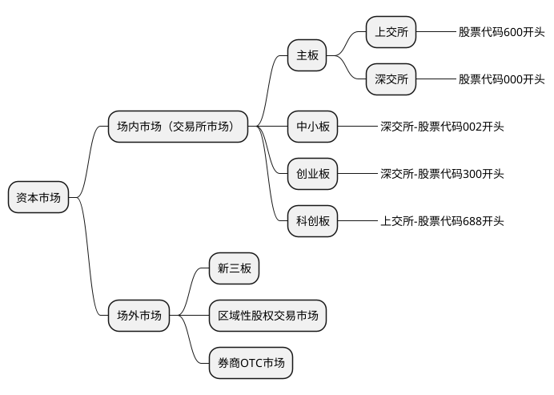

```plantuml
@startmindmap
* 资本市场
** 场内市场（交易所市场）
*** 主板
**** 上交所
*****_ 股票代码600开头
**** 深交所
*****_ 股票代码000开头
*** 中小板
****_ 深交所-股票代码002开头
*** 创业板
****_ 深交所-股票代码300开头
*** 科创板
****_ 上交所-股票代码688开头
** 场外市场
*** 新三板
*** 区域性股权交易市场
*** 券商OTC市场
@endmindmap
```
