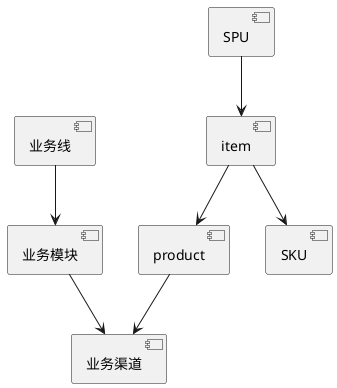

```plantuml
@startuml
component 业务线 as businessLine
component 业务模块 as businessModule
component 业务渠道 as businessChannel
component product
component item
component SPU
component SKU

businessLine --> businessModule
businessModule --> businessChannel
product --> businessChannel
SPU --> item
item --> SKU
item --> product

@enduml
```
