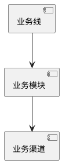

```plantuml
@startuml
component 业务线 as businessLine
component 业务模块 as businessModule
component 业务渠道 as businessChannel

businessLine --> businessModule
businessModule --> businessChannel

@enduml
```
