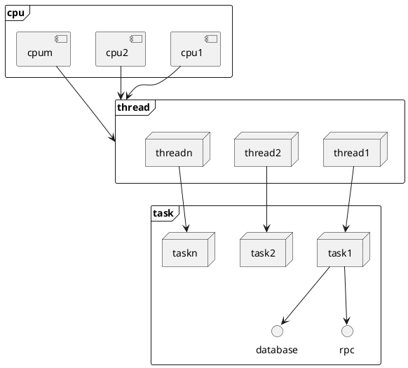

```plantuml
@startuml
frame cpu {
    component cpu1
    component cpu2
    component cpum
}

frame thread {
    node thread1
    node thread2
    node threadn
}

frame task {
    node task1
    node task2
    node taskn
    interface database
    interface rpc
}

cpu1 --> thread
cpu2 --> thread
cpum --> thread

thread1 --> task1
thread2 --> task2
threadn --> taskn

task1 --> database
task1 --> rpc
@enduml
```
