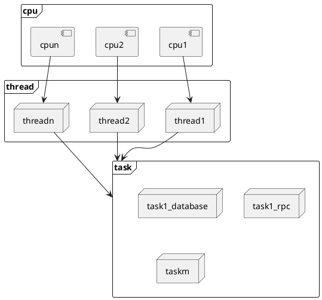

```plantuml
@startuml
frame cpu {
    component cpu1
    component cpu2
    component cpun
}

frame thread {
    node thread1
    node thread2
    node threadn
}

frame task {
    node task1_database
    node task1_rpc
    node taskm
}

cpu1 --> thread1
cpu2 --> thread2
cpun --> threadn

thread1 --> task
thread2 --> task
threadn --> task
@enduml
```
