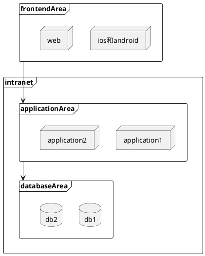

```plantuml
@startuml
frame frontendArea {
    node ios和android
    node web
}
frame intranet {
    frame applicationArea {
        node application1
        node application2
    }
    frame databaseArea {
        database db1
        database db2
    }
}

frontendArea --> applicationArea
applicationArea --> databaseArea
@enduml
```
