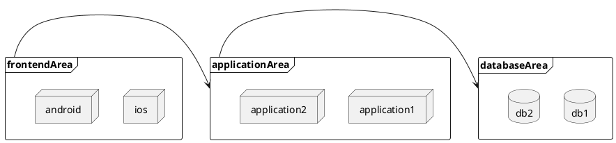

```plantuml
@startuml
frame frontendArea {
    node ios
    node android
}
frame applicationArea {
    node application1
    node application2
}
frame databaseArea {
    database db1
    database db2
}

frontendArea -> applicationArea
applicationArea -> databaseArea
@enduml
```
