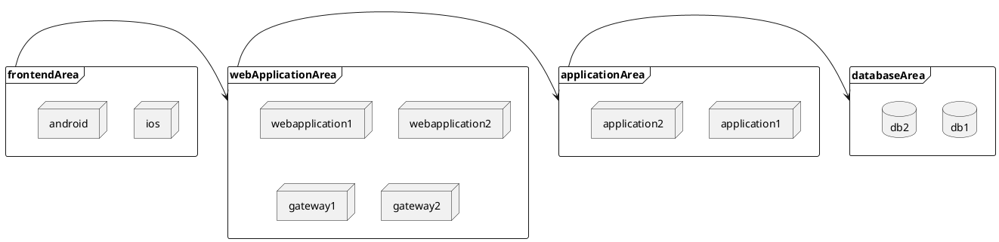

```plantuml
@startuml
frame frontendArea {
    node ios
    node android
}
frame webApplicationArea {
    node webapplication1
    node webapplication2
    node gateway1
    node gateway2
}
frame applicationArea {
    node application1
    node application2
}
frame databaseArea {
    database db1
    database db2
}

frontendArea -> webApplicationArea
webApplicationArea -> applicationArea
applicationArea -> databaseArea
@enduml
```
