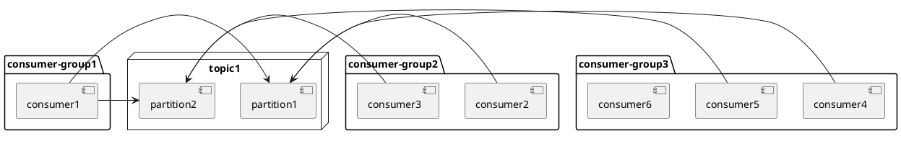

```plantuml
@startuml
node topic1 {
    component partition1
    component partition2
}

package consumer-group1 {
    component consumer1
}

package consumer-group2 {
    component consumer2
    component consumer3
}

package consumer-group3 {
    component consumer4
    component consumer5
    component consumer6
}

consumer1 -> partition1
consumer1 -> partition2

consumer2 -> partition1
consumer3 -> partition2

consumer4 -> partition1
consumer5 -> partition2

@enduml
```
