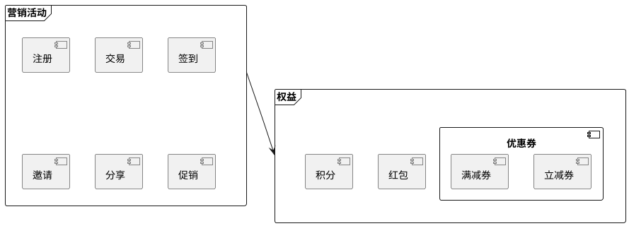

```plantuml
@startuml
frame 营销活动 {
    component 注册
    component 交易
    component 签到
    component 邀请
    component 分享
    component 促销
}
frame 权益 {
    component 优惠券 {
        component 立减券
        component 满减券
    }
    component 红包
    component 积分
}
营销活动 --> 权益

@enduml
```
