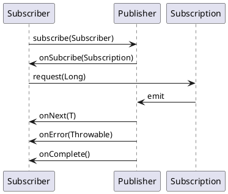

```plantuml
@startuml
Subscriber -> Publisher: subscribe(Subscriber)

Publisher ->  Subscriber: onSubcribe(Subscription)

Subscriber -> Subscription: request(Long)

Subscription -> Publisher: emit

Publisher -> Subscriber: onNext(T)
Publisher -> Subscriber: onError(Throwable)
Publisher -> Subscriber: onComplete()
@enduml
```