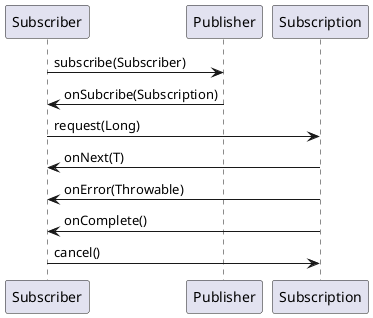

```plantuml
@startuml
Subscriber -> Publisher: subscribe(Subscriber)

Publisher ->  Subscriber: onSubcribe(Subscription)

Subscriber -> Subscription: request(Long)

Subscription -> Subscriber: onNext(T)
Subscription -> Subscriber: onError(Throwable)
Subscription -> Subscriber: onComplete()

Subscriber -> Subscription: cancel()

@enduml
```